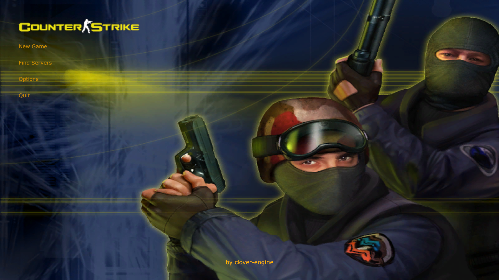
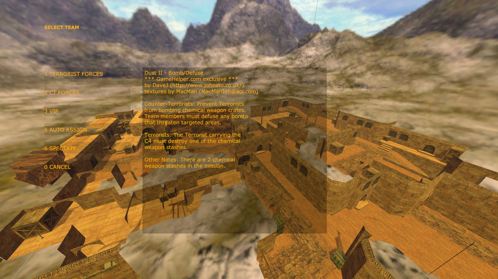
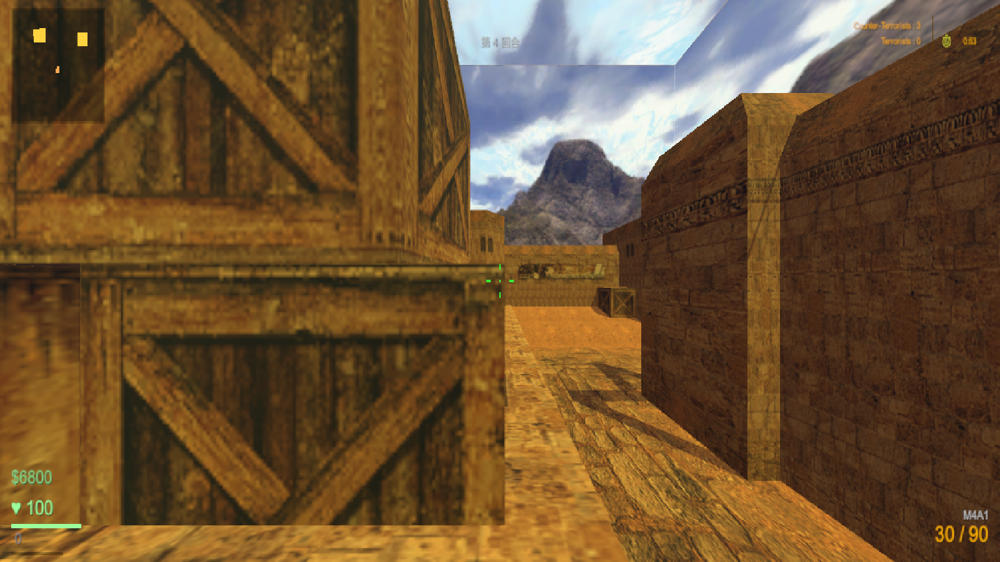
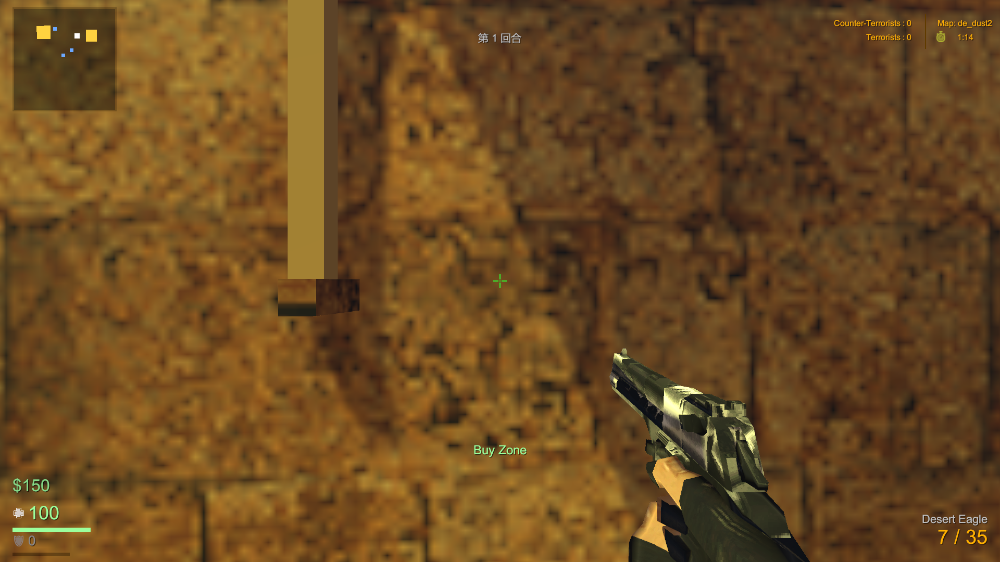

# clover-project-cs16

用 [Clover 客户端引擎](https://github.com/qw576483/clover-client-unity-engine) **1:1 复刻《反恐精英 1.6》单机模式**的项目工程。

地图为 **de_dust2**；系统清单按 `策划/策划案/CS1.6单机参考规格.md` 分六类：
**A 启动菜单 · B HUD · C 玩法 · D 机器人 · E 地图 · F 资源**。

| 主菜单 | 队伍选择 |
|---|---|
|  |  |

| 游戏内（A 点） | HUD（1920×1080） |
|---|---|
|  |  |

> 截图来自本工程的实机取证（复刻版真实运行画面，非原版素材）。

## 目录结构

| 路径 | 内容 |
|---|---|
| `client/` | Unity 工程（复刻本体；`Library/` `Temp/` `Logs/` 等生成物不入库） |
| `策划/` | `策划案/CS1.6单机参考规格.md`（复刻规格）、`对照表.md`、`验收表.md`（交付闸门）、`外观差异清单.md`、`素材调研.md`、`基线图/`（原版对照：dust2 自由视角、HUD、天盒贴图 + `场景清单.md`） |
| `tools/` | 判据与工具：`verify.ps1`（交付闸门）、`probes/`（探针与量法脚本）、`ai-skill/`（本工程专用 skill 片段） |
| `docs/` | `步骤文档.md` + `agents/`（agent-01 ~ agent-10 的并行任务书：外壳与流程、dust2 地图、比赛核心、FPS 与战斗、机器人 AI、游戏内 UI、视角与音频、门禁与参考、参考表与资源等） |

## 怎么跑

1. Unity **6000.x** 打开 `client/`；
2. `cd` 进 `client/` 后按 `策划/验收表.md`「驱动环境」一节执行 Unity CLI（编译、进 Play、探针的顺序都写在那里）；
3. 交付前跑 `tools/verify.ps1`。

## 验收口径

`策划/验收表.md` 是本工程的**交付闸门**：行 = 参考游戏的系统清单，每行结论不许为空。
类别列决定取证方式 ——

- **数值类**（数值/逻辑/状态/坐标/计时）⇒ 判据 = 运行时日志行 + 断言输出，不必截图；
- **表现类**（动画/贴图/UI 可见与对齐/颜色/时序观感）⇒ 必须进「联络图」（contact sheet）比对。

## 相关仓库

| 仓库 | 说明 |
|---|---|
| [clover-client-unity-engine](https://github.com/qw576483/clover-client-unity-engine) | 客户端引擎（本工程的运行底座） |
| [clover-tools](https://github.com/qw576483/clover-tools) | 打表工具、AI 交付 skill |
| [clover-doc](https://github.com/qw576483/clover-doc) | 框架文档 |
